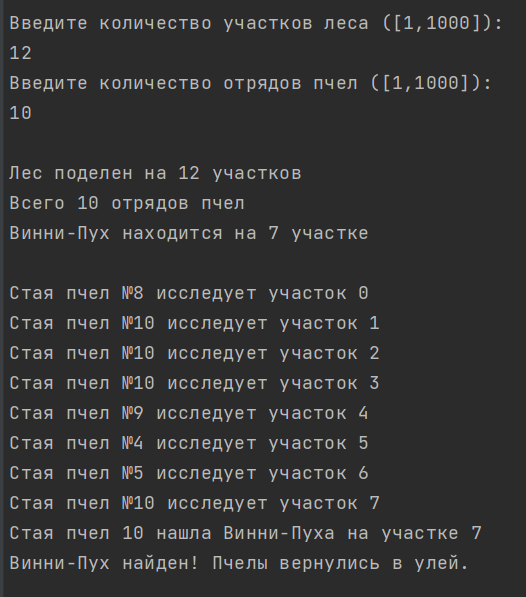
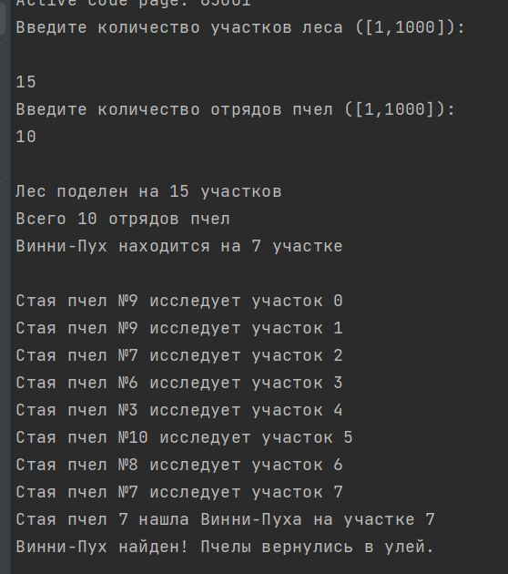

# IDZ-4-ABC-
# ИДЗ №4. Татаров Константин Манолисович БПИ 228
**Варинат 4. Работа выполнена на 7 баллов.\
Условие задания:**\
Задача о Винни-Пухе и мстительных пчелах. Неправильные
пчелы, подсчитав в конце месяца убытки от наличия в лесу ВинниПуха, решили разыскать его и наказать в назидание всем другим
любителям сладкого. Для поисков медведя они поделили лес на
участки, каждый из которых прочесывает одна стая неправильных пчел. В случае нахождения медведя на своем участке стая проводит показательное наказание и возвращается в улей. Если участок
прочесан, а Винни-Пух на нем не обнаружен, стая также возвращается в улей. Там она получает информацию об еще неисследованных участках и снова улетает. Требуется создать многопоточное
приложение, моделирующее действия пчел. При решении использовать парадигму «портфель задач». Каждая стая пчел — отдельный
поток.

**Решение:**\
[Код с комментариями](code/lastIddzFinaly)\
[Тест собраны тут](tests)

**Отчет по критериям:**

4-5: 
* Сценарий: задача состоит из улья, в котором располагается некоторое количество отрядов пчел, каждый из которых прочесывает свой участок леса в надежде найти Винни-Пуха. Если отряд нашел медведя, то он его наказывает, сообщая о находке остальным отрядам, и возвращается в улей, после чего пчелы больше не вылетают из него. Если же Винни-Пух не найден, то отряд обозначает, что данный участок уже обследован и сюда идти уже не нужно, и затем возвращается в улей чтобы узнать, на какой следующий участок леса нужно выдвинуться. В случае, если все учатски уже прочесаны (или текущий свободный участок выходит за пределы допустимых участков), то отряд не должен никуда лететь, а просто ждать, пока другой отряд накажет медведя.
* Модель параллельных вычислений заключается в использовании нескольких потов, каждый из которых представляет отдельный отряд и параллельно прочесывает не посещенные участки. Разделяемой переменной в разработанной программе является переменная, которая указывает на поимку Винни-Пуха (true/false), которая блокируется мьютексом соответственно.
* Входными данными программы являются количество участков леса и количество отрядов пчел. Каждая переменная должна принадлежать промежутку [1; 1000]
* Реализовано консольное приложение, решающее поставленную задачу с использованием одного варианта изученных синхропримитивов.
* Ввод данных в приложение реализован с консоли во время выполнения программы (без использования аргументов командной строки).
* Для используемых генераторов случайных чисел описаны их диапазоны и то, как интерпретируются данные этих генераторов.
* Созданный информативный вывод, который позволяет понять, что в данный момент происходит в программе: какая стая и какой участок леса прочесывает, наказывает Винни-Пуха или он уже найден.
* В программе присутствуют комментарии, поясняющие выполняемые действия и описание используемых объектов и переменных
* Результаты тестирования:
\

6-7: 
* Данный тип задачи и модели построения многопоточных приложений имеет достаточно прозрачную структуру решения, которая заключается в создании нескольких отдельных потоков, каждый из которых прдеставляет одну сущность (в нашем случае это отряд пчел), которая совершает какую-то работу параллельно с другими сущностями. Также в программе будет присутствовать разделяемая переменная, доступ к которой в один момент времени имеет только один поток или процесс, что мы будем ограниничивать с помощью, например, мьютекса и с помощью который мы как раз будем контролировать работу потоков (останавливать/продолжать их выполнение).
* В программу добавлена генерация случайных данных в допустимых диапазонах.
* Реализован ввод исходных данных из командной строки при запуске программы вместо ввода параметров с консоли во время выполнения программы.
